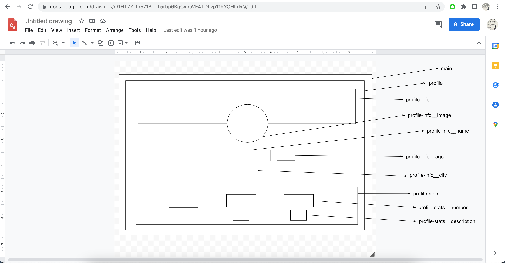
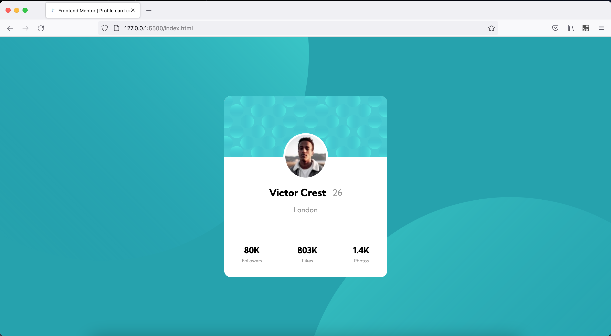
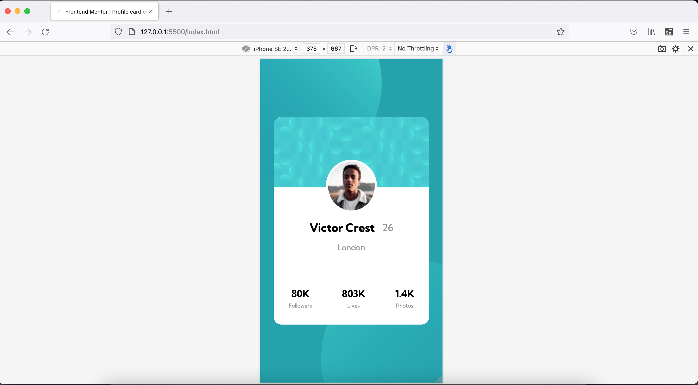

# Frontend Mentor - Profile card component solution

This is a solution to the [Profile card component challenge on Frontend Mentor](https://www.frontendmentor.io/challenges/profile-card-component-cfArpWshJ). Frontend Mentor challenges help you improve your coding skills by building realistic projects.

## Table of contents

- [Overview](#overview)
  - [The challenge](#the-challenge)
  - [Screenshot](#screenshot)
  - [Links](#links)
- [My process](#my-process)
  - [Built with](#built-with)
  - [What I learned](#what-i-learned)
  - [Continued development](#continued-development)
  - [Useful resources](#useful-resources)
- [Author](#author)
- [Acknowledgments](#acknowledgments)

## Overview

This is 6th project from "Frontend Mentor" to sharpen HTML & CSS skills along with responsive web design and it's build with BEM and Flex layout.

### The challenge

Adding multiple background images with correct position, proper usage of symantic HTML elements, flex layout and over all CSS good practices. Learning never STOPS.

### Screenshot

### Links

- [Solution URL ](https://vikramvi.github.io/Profile-card-component/)

## Author

- Frontend Mentor - [@vikramvi](https://www.frontendmentor.io/profile/vikramvi)

## Acknowledgments

Kevin Powell

- [Learn flexbox the easy way](https://www.youtube.com/watch?v=u044iM9xsWU&t=680s&ab_channel=KevinPowell)
- [Do you understand how Flexbox does what it does?](https://www.youtube.com/watch?v=9e-lWQdO-DA&ab_channel=KevinPowell)
- [Stop using Chrome if you're writing CSS](https://www.youtube.com/watch?v=a-V8GFtwjos&t=13s&ab_channel=KevinPowell)
- [Fastest way to be a MASTER web dev???](https://www.youtube.com/watch?v=2v3CWM5FmHs&t=4s&ab_channel=KevinPowell)
